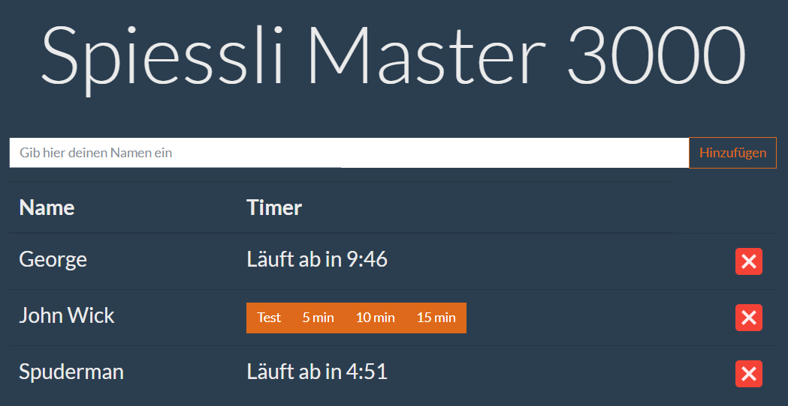

# Spiessli Master 3000

## What th is this?

Having barbecue with your friends? Tired of beeing the 'barbecue master' that has to do all the work?

Well then... it's time for Spiessli Master 3000!

SM 3000 allows you to set individual timers for you and your friends. When a timer expires, a friendly voice reminds you, that you should check your grillables.

Check out the demo [here](https://spiessli-master-3000.azurewebsites.net/)!

## Behind the scenes

TL;DR: There is nothing magic going on here..

The whole thing is pretty straight forward: Some really poor JavaScript for the logic, JQuery to simplyfy DOM manipulation and Bootstrap for styling, because i'm very bad at designing stuff. Text-to-speech is done via the [Speech Synthesis API](https://developer.mozilla.org/de/docs/Web/API/SpeechSynthesis).

## Limitations

* German only (sorry for that)
